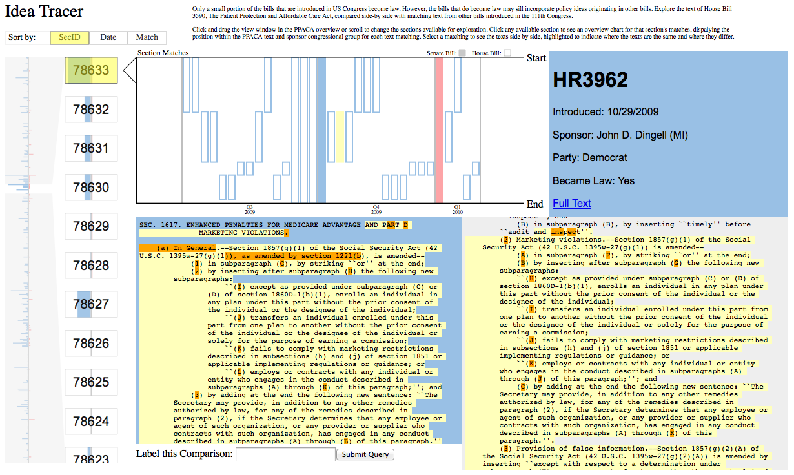

fp-robthomp-lgw2-samw11
===============

## Team Members

1. Robert Thompson, robthomp@cs
2. Lucy Williams, lgw2@uw
3. Sam Wilson, samw11@cs

## Development Process
Rob:
 * Data scripts
 * Alignment Graph
 * Text Highlighting
 * General Style
 * Poster and Paper
 
Lucy:
 * Overall design idea generation and critique
 * Short presentation
 * Poster and paper
 
Sam: 
 * Design and implement the first layer, second layer and the sort button feature.
 * Comment and refactor the code base.
 * Poster and paper
  
Idea Tracer
===============

Poster is available [here:](https://github.com/CSE512-14W/fp-robthomp-lgw2-samw11/blob/master/final/poster-robthomp-lgw2-samw11.pdf)

Final paper is availalbe [here:](https://github.com/CSE512-14W/fp-robthomp-lgw2-samw11/blob/master/final/paper-robthomp-lgw2-samw11.pdf) 

## Running Instructions

You can access our visualization at http://homes.cs.washington.edu/~samw11/512/final/ or download the repository and run it on a server with PHP installed. We used the [MAMP package](http://www.mamp.info/en/index.html) during development if you don't have your own server.
